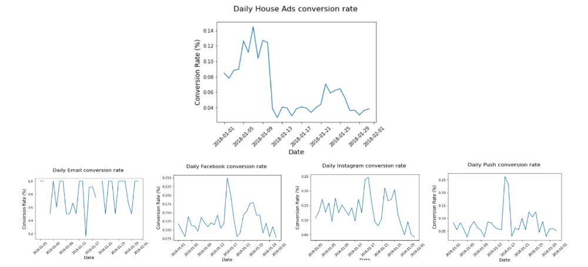
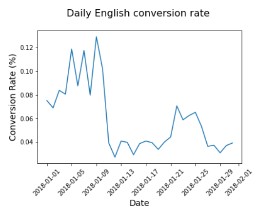
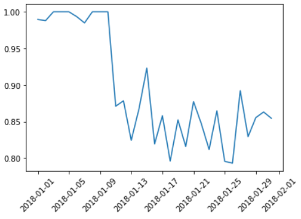

# Marketing-Ad Campaign Analysis
this project focuses on resolving inconsistencies found in our dataset and scaling the losses incurred due to it

for a more in-depth analysis, open the jupyter notebook which breaks down into the following structure:

1. after taking a look at segments of conversion rates we see that the house ads marketing team has an issue with it after the 11th

2. after finding ut day of week had nothing to do with the issue we find that the language is where the issue is

3. after investigating the language we find that only english ads were served after the 11th 

4. to see how many subscribers were lost due to this error, we tracked the sub rate other languages went at per english sub and applied that to the error period and found a loss of 32 subs due to the error

---

we are given the following table describing customer data

|       column        |  type   |
|---------------------|---------|
| userid              | numeric |
| date_served         | date    |
| marketing_channel   | text    |
| variant             | text    |
| converted           | numeric |
| language_displayed  | text    |
| language_preferred  | text    |
| age_group           | text    |
| date_subscribed     | date    |
| date_canceled       | date    |
| subscribing_channel | text    |
| is_retained         | numeric |
| day_of_week         | text    |
| channel_code        | text    |

upon exploratory analysis we can see that there is a problem with conversion rates, particularly with the house ads conversion channel

```python
daily_conversion_rate_by_channel = conversion_rate(marketing, ['date_served', 'subscription_channel'])
plotting_csv(daily_conversion_rate_by_channel.unstack(level=1))
```



upon investigating the languages those ads were delivered on for each date we can see that non-english languages were not served as regularly as english ads

```python
house_ads = marketing[marketing.marketing_channel=='House Ads']
conv_lang_channel = conversion_rate(house_ads, ['date_served', 'language_displayed'])

#plot
conv_lang_df = pd.DataFrame(conv_lang_channel.unstack(level=1))
plotting_conv(conv_lang_df)
```



after pivoting the df we can see the wrong language was served after the 11 of january

```python
house_ads['is_correct_lang'] = np.where(house_ads['language_displayed']==house_ads['language_preferred'],'yes','no')
language_check = house_ads.groupby(['date_served','is_correct_lang'])['user_id'].count()
language_check_df = pd.DataFrame(language_check.unstack(level=1)).fillna(0)

#plot
language_check_df['pct'] = language_check_df['yes'] / language_check_df.sum(axis=1)
plt.plot(language_check_df.index, language_check_df['pct'])
plt.show()
```

we get the following table

| is_correct_lang |  no  |  yes  |
|-----------------|------|-------|
| date_served     |      |       |
| 2018-01-01      |  2.0 | 189.0 |
| 2018-01-02      |  3.0 | 247.0 |
| 2018-01-03      |  0.0 | 220.0 |
| 2018-01-04      |  0.0 | 168.0 |
| 2018-01-05      |  0.0 | 160.0 |
| 2018-01-06      |  1.0 | 151.0 |
| 2018-01-07      |  2.0 | 130.0 |
| 2018-01-08      |  0.0 | 154.0 |
| 2018-01-09      |  0.0 | 157.0 |
| 2018-01-10      |  0.0 | 170.0 |
| 2018-01-11      | 20.0 | 135.0 |
| 2018-01-12      | 18.0 | 130.0 |
| 2018-01-13      | 26.0 | 122.0 |
| 2018-01-14      | 20.0 | 131.0 |
| 2018-01-15      | 16.0 | 192.0 |
| 2018-01-16      | 28.0 | 127.0 |
| 2018-01-17      | 21.0 | 127.0 |
| 2018-01-18      | 31.0 | 121.0 |
| 2018-01-19      | 22.0 | 127.0 |
| 2018-01-20      | 28.0 | 124.0 |
| 2018-01-21      | 14.0 | 100.0 |
| 2018-01-22      | 13.0 |  72.0 |
| 2018-01-23      | 16.0 |  69.0 |
| 2018-01-24      | 13.0 |  83.0 |
| 2018-01-25      | 19.0 |  74.0 |
| 2018-01-26      | 24.0 |  92.0 |
| 2018-01-27      | 18.0 | 149.0 |
| 2018-01-28      | 28.0 | 136.0 |
| 2018-01-29      | 24.0 | 142.0 |
| 2018-01-30      | 23.0 | 145.0 |
| 2018-01-31      | 23.0 | 135.0 |

after pivoting, the table graphs to this



we can see a spike occurs after the 11th in incorrect language served
now we see how many customers we lost by this mistake by comparing and translating the amount of english ads served before the error date

```python
# calculate the ratios compared to english for the period before the error
house_ads_no_bug = house_ads[house_ads['date_served']<'2018-01-11']
lang_conv = conversion_rate(house_ads_no_bug, ['language_displayed'])
spanish_index = lang_conv['Spanish'] / lang_conv['English']
arabic_index = lang_conv['Arabic'] / lang_conv['English']
german_index = lang_conv['German'] / lang_conv['English']

# calculate how many subscribers there should have been for each language based on the ratio for the time during the error
lang_conv2 = house_ads.groupby(['date_served','language_preferred']).agg({'user_id':'nunique','converted':'sum'})
lang_conv_df = pd.DataFrame(lang_conv2.unstack(level=1))
lang_conv_df['actual_english_rate'] = lang_conv_df['2018-01-11':'2018-01-31'][('converted','English')]
lang_conv_df['expected_spanish_rate'] = lang_conv_df.actual_english_rate * spanish_index
lang_conv_df['expected_spanish_conversion'] = lang_conv_df['expected_spanish_rate'] / 100 * lang_conv_df[('user_id','Spanish')]
lang_conv_df['expected_arabic_rate'] = lang_conv_df.actual_english_rate * arabic_index
lang_conv_df['expected_arabic_conversion'] =  lang_conv_df['expected_arabic_rate'] / 100 *lang_conv_df[('user_id','Arabic')]
lang_conv_df['expected_german_rate'] = lang_conv_df.actual_english_rate * german_index
lang_conv_df['expected_german_conversion'] =  lang_conv_df['expected_german_rate'] / 100 *lang_conv_df[('user_id','German')]

# add up all of the lost subscribers
bug_period = lang_conv_df.loc['2018-01-11':'2018-01-31']
expected_subs = bug_period['expected_spanish_conversion'].sum() + bug_period['expected_arabic_conversion'].sum() + bug_period['expected_german_conversion'].sum()
actual_subs = bug_period[('converted','Spanish')].sum() + bug_period[('converted','Arabic')].sum() + bug_period[('converted','German')].sum()
lost_subs = expected_subs - actual_subs
lost_subs
```

32 subscribers lost